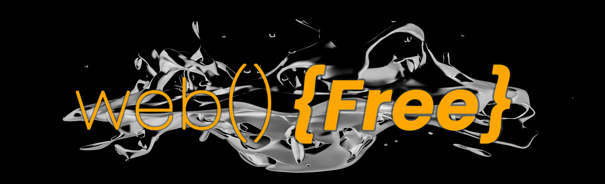

### Hi, Jérôme JULIEN there 👋

## Who am i ?
After 15 years in automotive industry research and development, i deciding to deep dive into blockchain.
French 🇫🇷 and fresh developer, living in Marseille 🌞, i want to dedicate my time to shape our future digital usecases, based on blockchain. 

Get the full control of our datas, our assets, our properties are the promises of the integration of blockchain into mainstream usecase.

**Free our digital life, free our web!!** 

## What am i doing ?
I'm a fullstack blockchain developer, focusing on smart contract and front end development

My favorite stack is :

           

I've just finished 12 months of intensive courses to become a -not hardcore skilled but- reliable fullstack developer, passionate by code and blockchain technologies, theirs possibilities and theirs promises !
  

## What do i want to do ?

I want to focus on project promoting decentralisation as backbone and mainstream deployement as target
  
## What have i done ?
So many things 😅 !!

Automotive designer, 3D modeler, international R&D project manager, Business unit manager, sales manager (hummm....not the best experience for me !)

This is a finished career, but for sure, somes skills will be usefull for my blockchain journey
  

## How to contact me?
Lot of solutions :
- **Discord** : jerome_0x_dev#5172
- **Twitter** : https://twitter.com/jerome_0x_dev
- **LinkedIn** : https://www.linkedin.com/in/jerome-0x-dev

<!--
**JeromeJULIEN/JeromeJULIEN** is a ✨ _special_ ✨ repository because its `README.md` (this file) appears on your GitHub profile.

Here are some ideas to get you started:

- 🔭 I’m currently working on ...
- 🌱 I’m currently learning ...
- 👯 I’m looking to collaborate on ...
- 🤔 I’m looking for help with ...
- 💬 Ask me about ...
- 📫 How to reach me: ...
- 😄 Pronouns: ...
- ⚡ Fun fact: ...
-->

